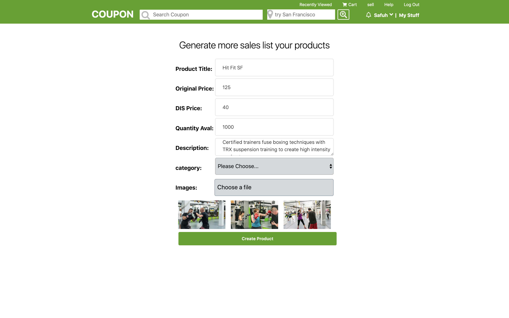
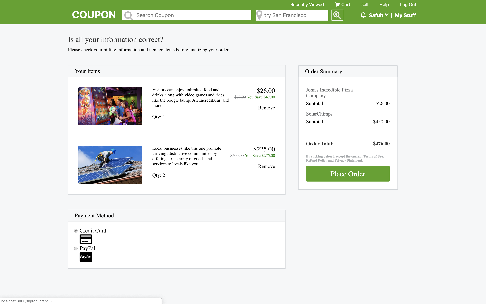

# Coupon
# Table of Contents
- [Background and Overview](#background-and-overview)
- [Features](#features)
- [Technologies](#technologies)
  - [Demo](#demo)
- [Site](#site)
  - [Splash Page](#splash-page)
  - [LogIn SignUp](#login-signup)
  - [Sell List a product](#sell-list-a-product)
  - [Cart](#cart)
  - [Search](#search)
  - [Filter listings around user location](#filter-listings-around-user-location)
  - [Recently Viewed](#recently-viewed)

## Background and Overview
  Coupon is full stack e-commerce marketplace connecting subscribers with local merchants inspired by Groupon. 
  
### Technologies

`Ruby on rails` backend including `activeRecord`, JavaScript `react-redux` frontend, and scaling `AWS S3` cloud computing. 
   and user data such as login and products informations was stored in a `PostgreSQL` database.
   
### Features
* Secure frontend to backend user authentication using BCrypt.
* Users can create, edit, and see products that they have.
* Users can add products to shopping cart.
* Users can search for products by the category, description or title.
* Users can also filter listing by location entered or detected by getting the user location by Geocoder gem. 
* Users not logged in will be redirected to sign in/register if trying to sell products or add items to cart.

### Demo
[Coupon Live](https://group-qpon.herokuapp.com/)


## Site

### Splash Page

Coupon splash page is a clone of the Groupon. It features all deals with the recently clicked product on top with the rest of products under.


### LogIn SignUp 
The user auth forms logIn/ SignUp page with red errors if any dispalyed at the top of the form!!


 Utilized BCrypt for password hashing to store in database which resulted in a more secure application. 
```Ruby
  def password=(password)
    @password = password
    self.password_digest = BCrypt::Password.create(password)
  end

  def reset_session_token!
    self.session_token = SecureRandom.urlsafe_base64
    save!
    self.session_token
  end
```


### Sell List a product 

Improved scalability by utilizing AWS S3 to Implement a multiple photos or files uploading feature, allowing users to list items on the application.
handleSubmit is triggered when the list form is submitted then formDate is used to shape sending data to AWS and to the backend!!



```Javascript
 handleSubmit(e) {
    e.preventDefault();
    
    const formData = new FormData();
    formData.append('product[productName]', this.state.productName);
    formData.append('product[price]', this.state.price);
    formData.append('product[disPrice]', this.state.disPrice);
    formData.append('product[description]', this.state.description);
    formData.append('product[quantity]', this.state.quantity);
    formData.append('product[category]', this.state.category);


    if (this.state.photoFile.length) {
      for (let i = 0; i < this.state.photoFile.length; i++) {
        formData.append('product[photos][]', this.state.photoFile[i]);
      }
    }
    this.props.action(formData, this.props.match.params.productId).then(() => this.props.history.push('/'));
  }
```
handleFile triggered each time we upload photos to display them to user to make sure the uploaded photos are the right ones.

```Javascript
 handleFile(e) {
    let result = Object.values(e.target.files);
    let files = e.target.files;
    let that = this
    
    for (let i = 0; i < files.length; i++) {
      let file = files[i];
      let reader = new FileReader();
      reader.onload = function (e) {

        let phtfile
        if(i === 0) {
          phtfile = that.state.photoFile.concat(result)
        } else  {
          phtfile = that.state.photoFile
        }
        
        that.setState({ photoUrl: that.state.photoUrl.concat([reader.result]), photoFile: phtfile});
      };
      reader.readAsDataURL(file);
    }

```

### Cart

Each user have a unique cart that calculate total order and give the user the ability to modify the order adding or removing items.



### Search
Implemented dynamic search using activerecord to querying the database with many options for user to search by (category, description or title).


Product modle search methods to query the `PostgreSQL` database using `activeRecord`.

```Ruby
def self.search_results(str)
        return Product.all if str == ""
        param = "%" + str.downcase + '%'
        
        products_des = Product.where('lower(description) LIKE ?', param).to_a
    end
```

### Filter listings around user location
Detected location by geting the user coordinates(latitude, longitude) then sending it to the backend for ruby Geocoder gem to get the closest city to user locations and save it to localStorage to be save for that specific user.


handlelocation get called when a user click on the locating buttom with ask user permision to get their location!! then it receive the coordinates to send them to the backend for giting closest city between ("San Francisco", "Austin", "Los Angeles", "Boston", "New York") to user locations 

```Javascript
  handlelocation(e) {
      e.preventDefault();
      if (navigator.geolocation) {
        navigator.geolocation.getCurrentPosition(this.showPosition.bind(this));
      } else {
        alert("Unable to retrieve your location, Please type in your location!! ");
      }
    }
   
   
  showPosition(position) {
     let location = { latitude: position.coords.latitude, longitude: position.coords.longitude }
     this.props.getlocation(location).then(() => {
       location['city'] = this.props.currlocation;
       let city = this.get_city_db(location);
      this.props.search(city).then(() => {
        this.props.history.push(`/city?=${city}`);
      });
    });
  }
```

### Recently Viewed
  Show the last four recently viewed items by the user and display them in ascending order with the last item clicked on top for quik acess
  


[Back to Top](#)
