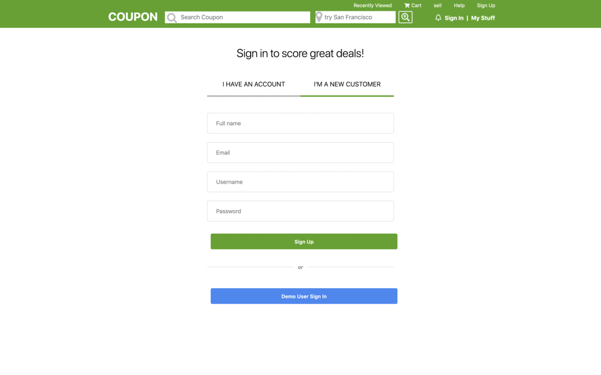

# Coupon
# Table of Contents
- [Background and Overview](#background-and-overview)
  - [Demo](#demo)
- [Features](#features)
- [Technologies](#technologies)
- [Site](#site)
  - [Splash Page](#splash-page)
  - [In-Game](#in-game)
  - [Game Over](#game-over)
- [Feature Highlights](#feature-highlights)
  - [Collision Detection](#collision-detection)
  - [Animate a line in after effects by mouse movement](#animate-a-line-in-after-effects-mouse-movement)
  - [canvas on different screen sizes](#canvas-on-different-screen-sizes)

## Background and Overview
  Coupon is full stack e-commerce marketplace connecting subscribers with local merchants inspired by Groupon. 
  
### Technologies

`Ruby on rails` backend including `activeRecord`, JavaScript `react-redux` frontend, and scaling `AWS S3` cloud computing. 
   and user data such as login and products informations was stored in a `PostgreSQL` database.
   
### Features
* Secure frontend to backend user authentication using BCrypt.
* Users can create, edit, and see products that they have.
* Users can add products to shopping cart.
* Users can search for products by the category, description or title.
* Users can also filter listing by location entered or detected by getting the user location by Geocoder gem. 
* Users not logged in will be redirected to sign in/register if trying to sell products or add items to cart.


### Demo
[Coupon Live](https://group-qpon.herokuapp.com/)


## Site

### Splash Page

Coupon splash page is a clone of the Groupon. It features all deals with the recently clicked product on top with the rest of products under.


### LogIN / SignUp 
The user auth forms logIn/ SignUp page with colored errors dispalyed if any!! Used BCrypt for password hashing which resulted in a more secure application.



### Sell / List a product 

Improved scalability by utilizing AWS S3 to Implement a multiple photos or files uploading feature, allowing users to list items on the application.


### Game Over

Upon game death, red dots will explodes flashing, the menu will reappear with your score.


## Feature Highlights

### Collision Detection

The game detects Serpentine and red dots Collied by comparing the distance between the two objects by the sum of their square radius then square rooting the result. If the result is greater than the distance, the method collision(red_ball) would take one live of the user game session and would draw an explosion. Also this.date is update it to give the user a free short time before he collide with another object.

```
  collision(red_bl) {
    if (Date.now() - this.date <= 700) {
      this.drawExplosion(red_bl.ball_x, red_bl.ball_y, 5, "#FFD700");
      return null;
    }

    let dif_x = Math.pow(red_bl.ball_x - this.crl.ball_x, 2);
    let dif_y = Math.pow(red_bl.ball_y - this.crl.ball_y, 2);
    let dis = Math.sqrt(dif_x + dif_y);
    let both_rds = red_bl.radius + this.crl.radius;

    if (dis <= both_rds) {
      this.game.live -= 1;
      this.date = Date.now();
      this.audio.play()
      this.drawExplosion(red_bl.ball_x, red_bl.ball_y, 5, "#FFD700");
    }
  }

```
### draw explosion on collisions
 When Serpentine collide with any red dots the game will draw a flashing explosion by adding shadowoffset by x and y of the dot!!
```
 drawExplosion(x, y, radius, color) {
    this.ctx.shadowBlur = 8;
    this.ctx.shadowColor = "gold";
    this.ctx.shadowOffsetX = 3;
    this.ctx.shadowOffsetY = -3;

    this.ctx.fillStyle = color;
    this.ctx.beginPath();
    this.ctx.arc(x, y, radius, 0, 2 * Math.PI, true);
    this.ctx.fill();
  }

```

### Animate a line in after effects (mouse movement)
Game will render the players trail as an array of small lines connected together. drawline function will draw each small line then their positions get updated by updatePos function as it map over the array of lines.

```
  drawline(fromx, fromy, toX, toY) {
    this.ctx.strokeStyle = "#4abaa3";
    this.ctx.lineWidth = 3;
    
    const sdb =  this.ctx.shadowBlur;
    const sdc =  this.ctx.shadowColor;
    const sdx = this.ctx.shadowOffsetX;
    const sdy = this.ctx.shadowOffsetY;

    this.ctx.shadowBlur = 8;
    this.ctx.shadowColor = "blue";
    this.ctx.shadowOffsetX = 5;
    this.ctx.shadowOffsetY = 5;

    this.ctx.beginPath();
    this.ctx.moveTo(fromx, fromy);
    this.ctx.lineTo(toX, toY);
    this.ctx.stroke();
  }
}

 updatePos() {
      this.xs = this.xs.map(val => val - 2)
      this.ys = this.ys.map(val => val + 1.2)

      this.xs.push(this.crl.ball_x)
      this.ys.push(this.crl.ball_y)
    
    
    if (this.xs.length > 50) {
      this.xs.shift()
      this.ys.shift()
    }
  }
```

### Canvas on different screen sizes
 Canvas adjust on different users screen size by giving the canvas a height and width as a portion of user window size
```
const canvasEl = document.getElementById("game-canvas");
  const ctx = canvasEl.getContext("2d");
  canvasEl.width = window.innerWidth / 1.68;
  canvasEl.height = window.innerHeight / 1.58;
```
### Start, pause, restart!!
The Game have one EventListener for any clicks on any buttons wether it was mutes, pause, or even restart the game with multiple if statements to determine the appropriate action. 
```
document.addEventListener('click', function (event) {
    if (event.target.classList.contains("start")) {}
    else if (event.target.classList.contains("fa-play") || event.target.id === "pause") {}
    else if (event.target.classList.contains("fa-volume-mute") || event.target.classList.contains("fa-volume-up") ) {}
    ..
```

[Back to Top](#)
